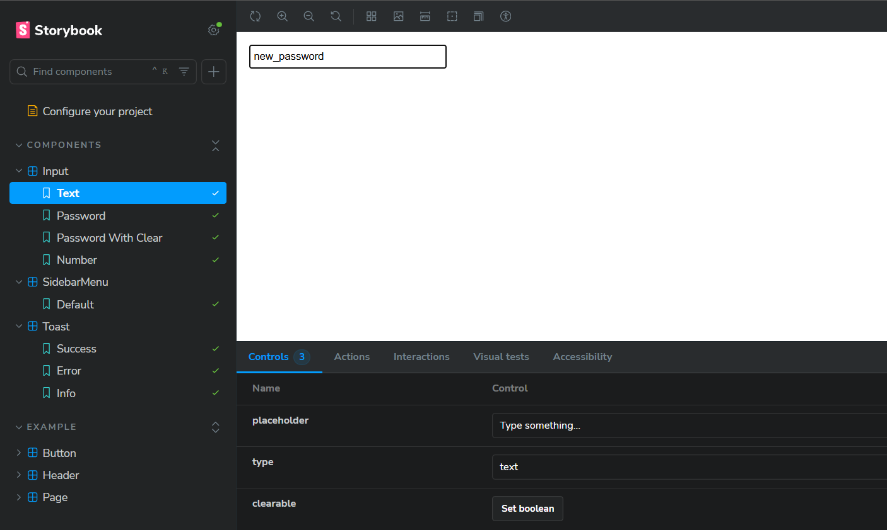
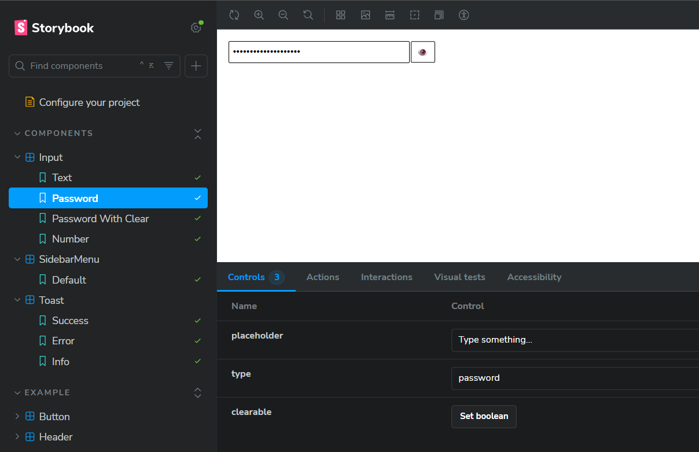
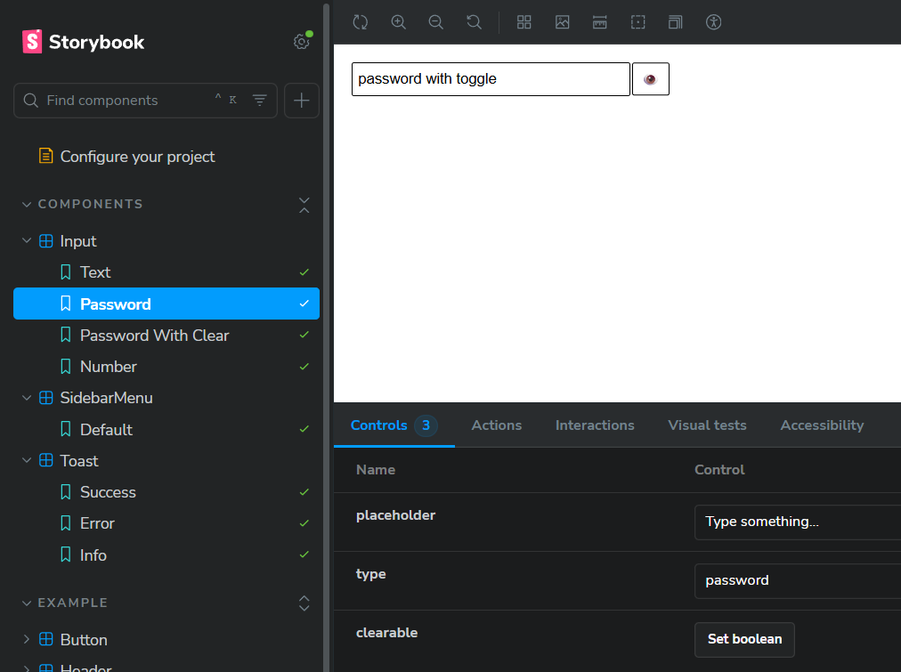
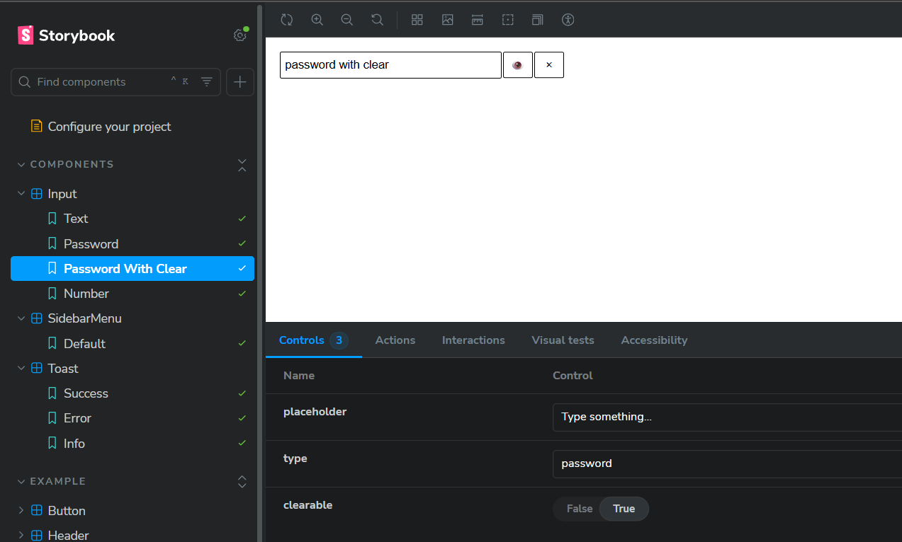
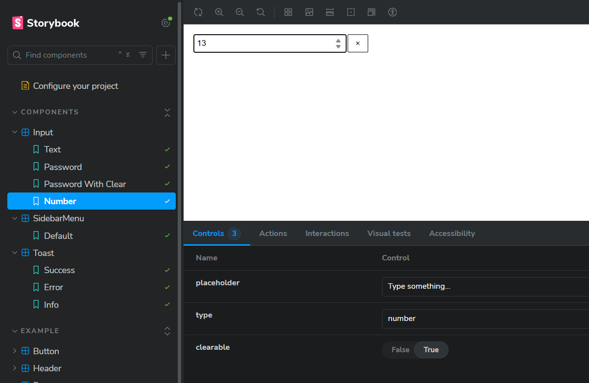
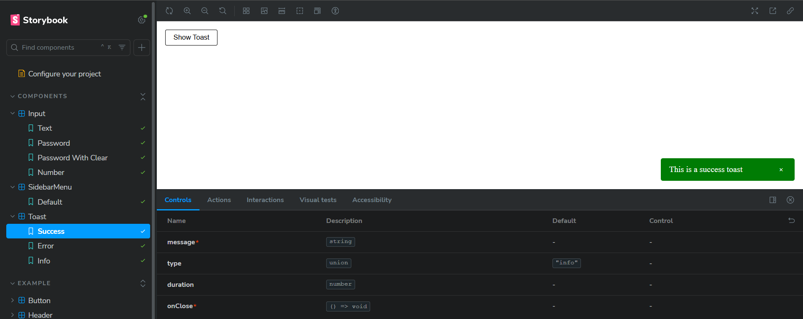
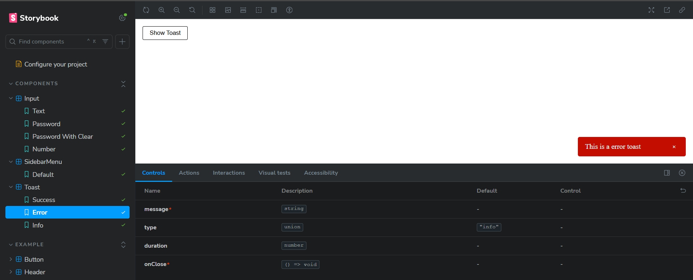
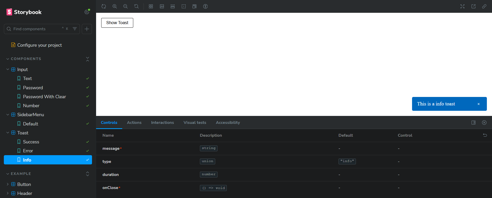
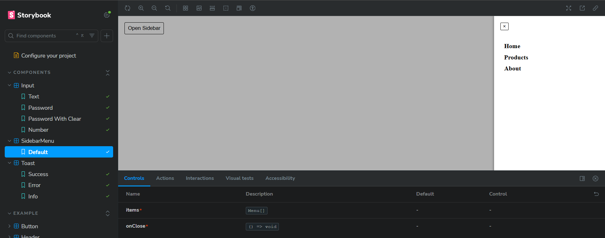
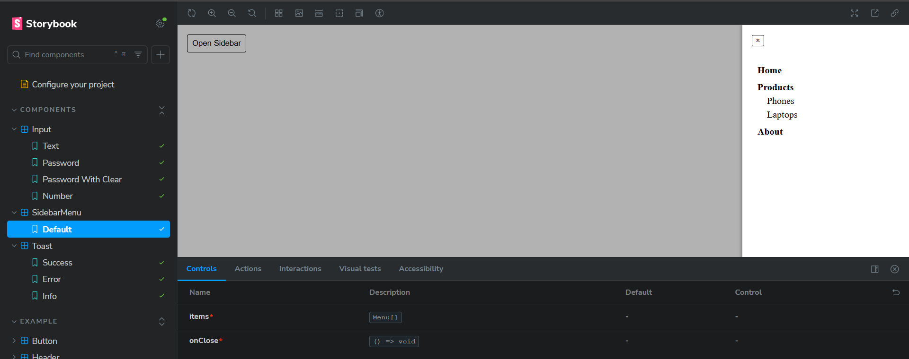

# React Component Library

This is a small **React component library** created for a front-end test assessment. The library includes three reusable UI components displayed in **Storybook** with different states and props.

## Getting Started

### Installation

```bash
# Clone the repository
git clone https://github.com/MichaelSoldatenko/react-component-library

# Install dependencies
npm install

# Run Storybook
npm run storybook
```

Storybook will open in your browser at http://localhost:6006, where you can see all components in different states.

## Components Overview

1. **Input Component**

A smart input with multiple types and additional features:

_Props_:
type: "text" | "password" | "number"
clearable: boolean (shows a clear button)

_Features_:
Password visibility toggle
Clearable input

_Storybook examples_:
Text input
Password input with toggle
Password input with toggle + clearable
Number input with clearable

### Screenshots:











2. **Toast Component**

A notification message displayed in the bottom-right corner.

_Props_:
message: string
type: "success" | "error" | "info"
duration: milliseconds (auto-dismiss)
onClose: callback when closed manually

_Features_:
Auto-dismiss after duration
Fade/slide transitions
Optional manual close button

_Storybook examples_:
Success, Error, Info toasts
Different durations

### Screenshots:







3. **Sidebar Menu Component**

A right sliding sidebar with nested menu items.

_Props_:
items: array of menu items (nested)
onClose: callback when sidebar closes

_Features_:
Slides in from the right
Nested submenus (accordion style)
Closes when background is clicked

_Storybook examples_:
1-level menu
2-level nested menu
Open and closed states

### Screenshots:





## Development Guidelines

_TypeScript + React_

_Functional components with hooks_

_ESLint + Prettier for code style_
